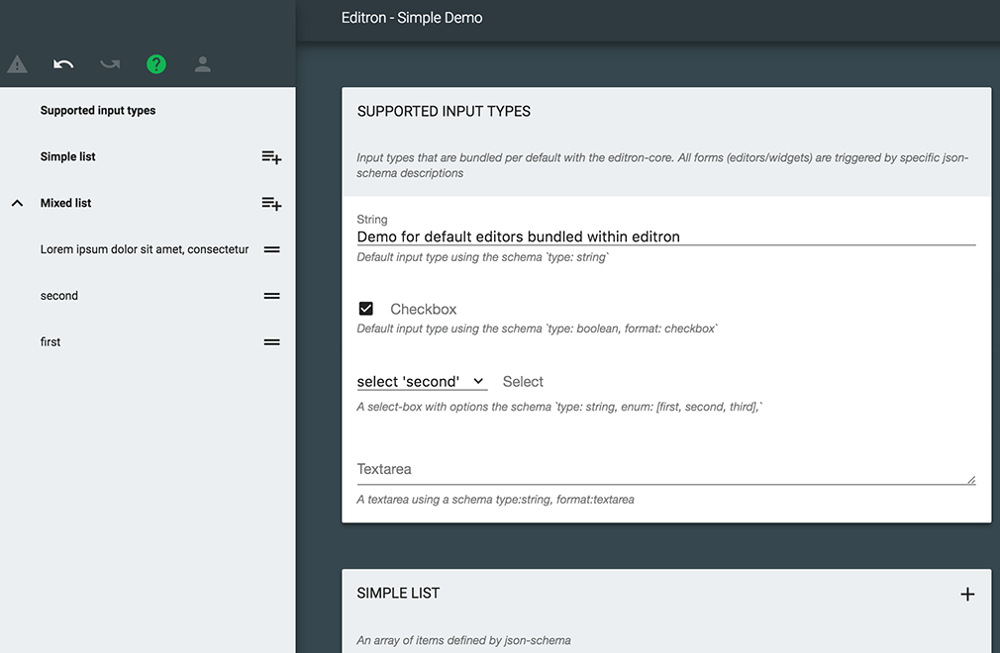

> Very customizable, extendable, fast and hackable json-editor (like
> [jdorn/json-editor](https://github.com/jdorn/json-editor)), to build your data-input-interface based on a json-schema


# Editron Core

> This is the core of the editron editor. It may be used to build a custom application (instead of using the default
> [editron](https://github.com/sueddeutsche/editron) application).

This is the base for building a complete [editron](https://github.com/sueddeutsche/editron) json-editor. Its Controller may be used to setup one or many input-forms, based on nested editors for each input-data. The core and the main app are still under development and the api has not yet settled. Still, it is flawlessly used in production for a CMS at the Süddeutsche Digitale Medien GmbH.




## Features

- Full [json-schema](http://json-schema.org/) draft04 support
- Basic editors supporting _objects_, _arrays_, _checkboxes_, _oneOf-selection_, _textarea_, _input_ and _selections_
- Additional editors currently available
    - _editron-wysiwyg-editor_
    - _editron-script-editor_
    - _editron-overview-navigation_
- inline-validation
- undo/redo
- display only a specific data pointer or switch them, using [json-pointer-syntax](https://github.com/sagold/gson-pointer)
- collaborative editing using _editron-sync-service_
- optional styles, supporting custom styling
- customizable translations and error-messages
- add custom editors (aka widgets)
    - basically independent of any frameworks ([mithriljs](https://mithril.js.org/) is used internally)
    - access to all methods
    - some important implementation details are required, but therefore offer the most flexibility
    - build-helpers and integration tests
    - independent builds, enabling new editors through a simple include-script


## Installation

`npm i editron-core --save`

Add the required fonts and rendering dependencies to your website

```html
<link href="https://fonts.googleapis.com/css?family=Roboto:300,400,700" rel="stylesheet">
<link href="https://fonts.googleapis.com/icon?family=Material+Icons" rel="stylesheet">
<script type="text/javascript" src="https://cdnjs.cloudflare.com/ajax/libs/mithril/1.1.3/mithril.min.js"></script>
```

And add the editron-core modules and their export (paths depend on your build-setup):

```html
<link rel="stylesheet" href="../node_modules/editron-core/dist/editron-core.css">
<script type="text/javascript" src="../node_modules/editron-core/dist/editron-modules.js"></script>
<script type="text/javascript" src="../node_modules/editron-core/dist/editron-core.js"></script>
```


## Usage

`editron-core.js` exposes a global object `editronCore` to the window object, which may be accessed to retrieve the main Controller, which is the basis of an editron-editor:

```js
    // and create a new editor instance (referencing a unique json-schema and data)
    const controller = new editronCore.Controller(myJsonSchema, myJsonData);
    // create the editor within the selected DOM-Element
    const main = controller.createEditor("#", document.querySelector("#editor"));

    // create another form for the data-point at { header: ... }
    const header = controller.createEditor("#/header", document.querySelector("#editor-header"));

    // receive a notification when the data has changed
    controller.data().observe("#", (event) => {
        console.log("data has changed to", controller.data().get());
    });

    // access services for further functionality
    const dataService = editor.data();
    const schemaService = editor.schema();
    const validationService = editor.validator();
```

for details on the services checkout [json-schema-services](https://github.com/sueddeutsche/json-data-services)


## Build your own application using webpack

> You may also build a custom application using webpack. Following the build steps of
> [webpack.build.js](https://github.com/sueddeutsche/editron-core/blob/master/webpack.build.js) should answer most
> questions.


```js
const editronCore = require("editron-core");
const Controller = editronCore.Controller;

// follow usage explanation above
```
