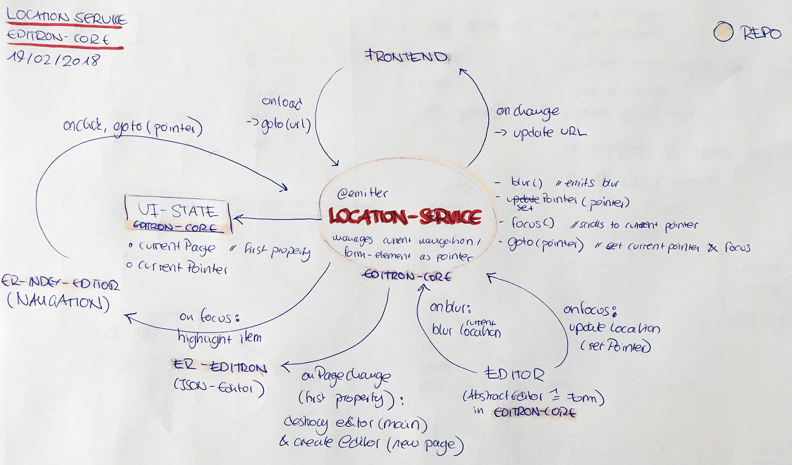

# Services

> frontend-services exposed by editron-core

Combines multiple services to help working with json-data manipulation, synchronisation and validation.

- The `DataService` manages application state and retrieval. Additional supports undo.
- The `ValidationService` validates any data by a given JSON-schema.
- The `SchemaService` returns the JSON-schema at the given JSON-pointer location

All services offer an interface based on [JSON-pointer](https://tools.ietf.org/html/rfc6901).


## Services


### Location-Service

get the location singleton from `controller.location()`

- Manages current user-focus as a json-pointer
- emits events
- unfortunately has a concept of "page", which is the first property of json-pointer




### DataService

Data can only be changed via the data-service methods. Each state is tracked within the services, enabling und/redo functionality.

```js
// get data at json-pointer
const dataService = new DataService(new State(), jsonData);
dataService.get("#/content/header/title");
```

#### Data manipulation methods

```js
// Set data at given path
dataService.set(pointer, data);
// Set data at given path
dataService.delete(pointer, data);
// Set last set/delete action
dataService.undo();
// redo last undo action
dataService.redo();
```

#### DataService events

```js
// called before any data changes of the action
dataService.on("beforeUpdate", callback)
// called after data changes, before observe events 
dataService.on("afterUpdate", callback) 
// Events bubble up to root pointer (#), # is last event
dataService.observe(pointer, callback, true) 
```


#### Dataservice event object

```js
// callbacks
function callback(event) {}
```

```js
// event object
{
    action: "SET_DATA", // @see store/actions.ActionTypes
    pointer: "#/pointer/location",
    parentPointer: "#/pointer",
}
```


### ValidationService

Sends error notifications on changed data.

```js
// create a new data validation service
const validationService = new ValidationService(new State(), jsonSchema)
```

```js
// called before a next validation
validationService.on("beforeValidation", callback)     
// Validation Events bubble up to root pointer (#)
validationService.observe(pointer, callback, true)   
// called after notifying observers 
validationService.on("afterValidation", callback)    
// validate data
validationService.validate(data).then((errors) => {})
```
